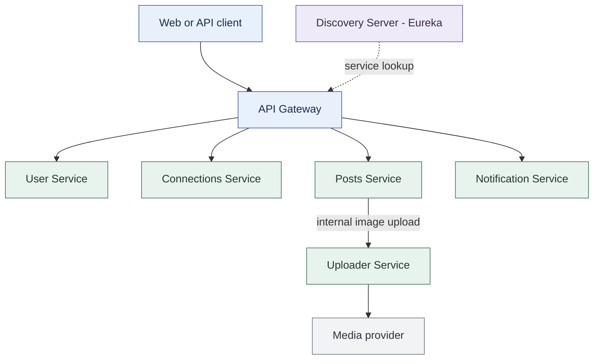
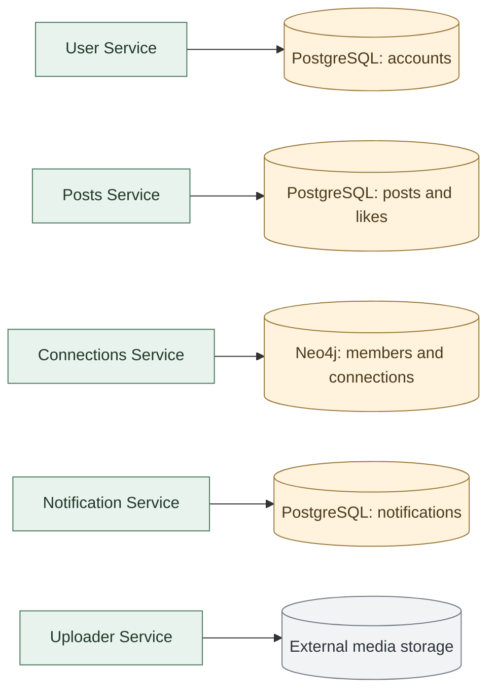
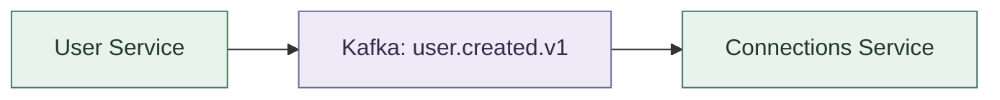
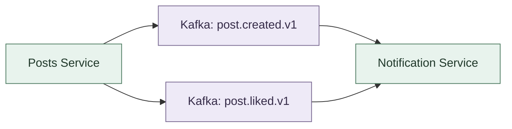
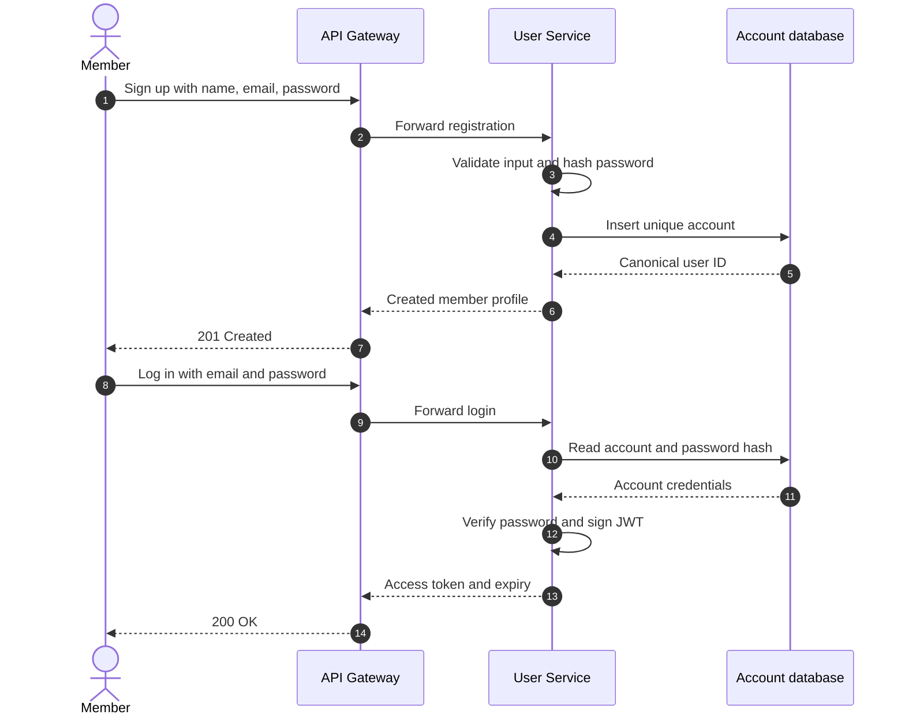
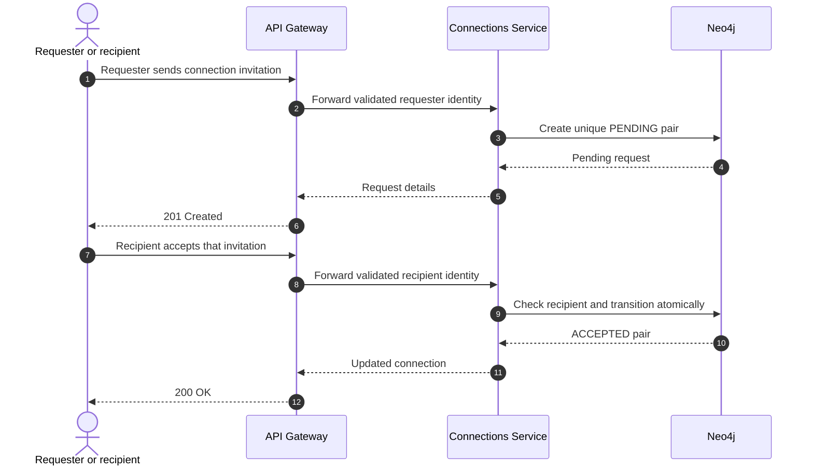
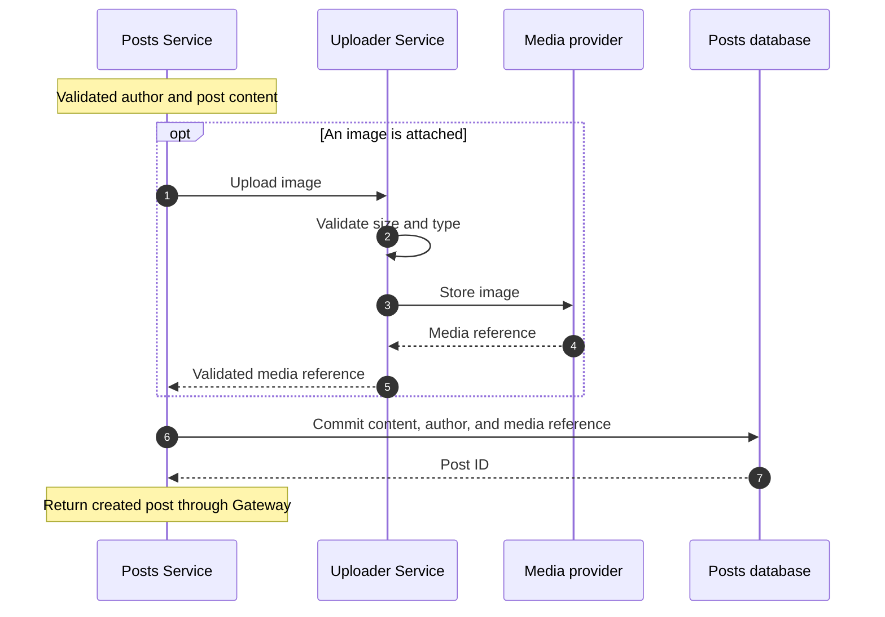
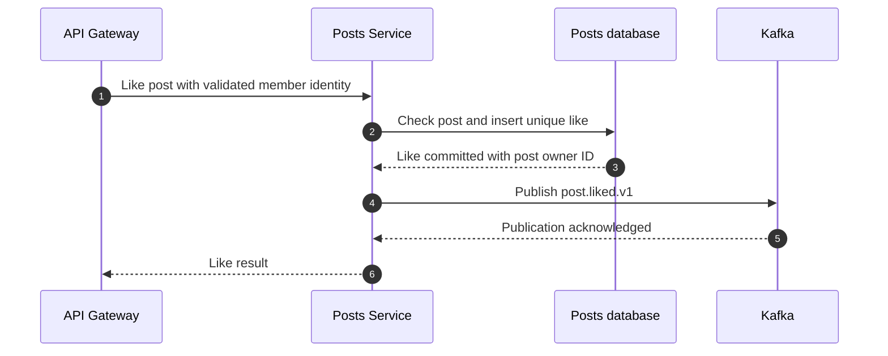
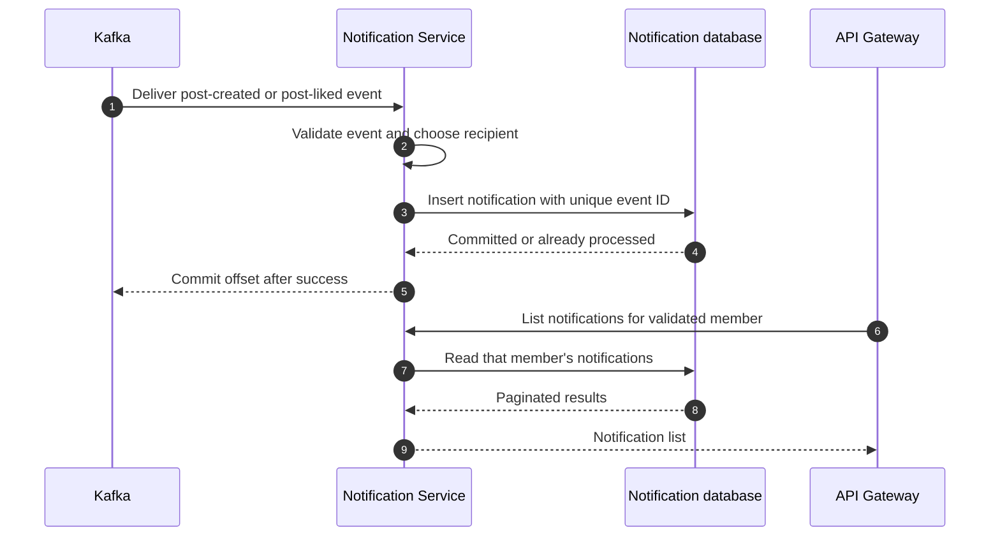

# System Architecture and Request Flows

The planned architecture divides account management, networking, content, notifications, and media into five business services. API Gateway will provide the public entry point, while Discovery Server will manage service locations.

[Project plan](project-plan-and-roadmap.md) · [API specification](api-specification.md) · [Kafka topics and events](kafka-topics-and-events.md) · [Database design](database-design.md)

## 1. Service layout

Read this view from top to bottom: client, public entry point, then the services that expose member-facing APIs. Uploader Service supports Posts internally. Storage and Kafka are shown in dedicated views below to keep each diagram focused.

**Visual key:** blue = client and access layer; green = business services; violet = discovery or messaging; amber = data storage; gray = external provider. Every box is labeled so color is supplementary.

Gateway will route account, connection, post, and notification requests. The upload endpoint will be accessible to Posts Service on the internal network. All application components using discovery will register with Eureka; the dashed line highlights Gateway's lookup responsibility. Eureka is a service registry, not a proxy through which requests pass.

## 2. Data ownership

Each row shows one service and its storage boundary. A local PostgreSQL instance can host separate schemas and credentials for User, Posts, and Notification. Services will access only their own schemas.

User Service will issue the canonical user ID. Other services will store that ID as a reference or a local projection. Posts will own the media reference attached to a post; Uploader will own the integration with the external storage provider. See [Database Design and Data Ownership](database-design.md) for fields, constraints, and graph queries.

## 3. Kafka event delivery

These two small diagrams show producers on the left, Kafka topics in the center, and consumers on the right. Topic names match the [event contracts](kafka-topics-and-events.md).

### Member projection

### Post activity notifications

Posts will obtain connection IDs through an internal HTTP call to Connections Service. It will publish one post-created notification event for each selected recipient. A post-liked event identifies the post owner as recipient. Kafka consumers will handle redelivery without duplicating their database effects.

## 4. Architecture decisions

| Decision | Planned approach | Reason and trade-off |
| --- | --- | --- |
| Identity ownership | User Service issues JWT; Gateway validates it | Account and credential rules have one owner. Internal services still need a protected trust boundary. |
| Data ownership | Separate PostgreSQL schemas; Neo4j owned by Connections | Independent writes and migrations; projections and cross-service references require reconciliation. |
| HTTP versus Kafka | HTTP for upload and connection lookup; Kafka for member projection and notifications | Immediate results use HTTP. Delayed effects use events, requiring retry and duplicate handling. |
| Post availability | Keep a committed post available when notification processing fails | Notifications can lag. The reliability milestone must persist and recover pending publication work. |
| Connection graph | Neo4j with one authoritative node per member pair | Makes pair state and traversal explicit. PostgreSQL adjacency tables offer a simpler operational alternative. |
| Media storage | One provider behind Uploader Service | Keeps provider details out of Posts; selection depends on cost, access policy, and deletion support. |
| Discovery | Add Eureka after service APIs are stable | Develop service registration and name resolution after the basic request paths work. |

## 5. Security boundaries

Gateway will permit signup and login anonymously and validate JWT signature, expiration, issuer, and audience on protected routes. User Service will hash passwords through Spring Security and issue short-lived tokens with the canonical user ID in `sub`.

Gateway will remove every client-supplied `X-User-Id` value before setting the validated subject. Downstream services will reject missing or malformed identity and enforce resource ownership: only a request recipient can accept a connection, and only a notification recipient can read it. Author and liker identity will come from authenticated context.

Forwarded identity is trustworthy only inside a controlled boundary. Business service ports will be private in a shared deployment, and internal HTTP callers must use authenticated service access or forward a token that the receiving service can validate. A private network alone does not authorize every caller. The initial local setup can bind service ports to localhost; before a public deployment, validate JWTs downstream or authenticate Gateway and service callers explicitly.

A symmetric key supplied through environment configuration is a possible starting point for User Service and Gateway. Asymmetric signing would let verification services hold only a public key. Keys, database passwords, and media credentials will stay outside Git and logs. Only operationally necessary health information will be exposed publicly.

## 6. Registration and login

This request diagram shows the HTTP path. Registration will also produce `user.created.v1` for the graph projection shown above; the member can log in while that projection catches up.

Invalid credentials will return a generic authentication error. Duplicate email registration will fail predictably through both validation and a database uniqueness constraint. Database commit and event publication are separate operations; the reliability milestone will introduce an outbox to recover publication failures.

## 7. Connection request and acceptance

The same request path serves two actors: the requester sends the invitation, then the recipient accepts it. Gateway validates each actor independently.

Only the recipient may accept or reject. A unique unordered pair key prevents two simultaneous reverse requests from producing duplicate pairs. An accepted pair makes each member a first-degree connection of the other. See [connection state and concurrency](database-design.md#connection-state-and-concurrency).

## 8. Create a post with an image

The authenticated request reaches Posts through Gateway. This focused view expands the upload and persistence steps inside that request; event delivery is shown separately below.

Upload failure will fail the image-post request before persistence. If upload succeeds but database persistence fails, an orphan object may remain; media cleanup belongs in the lifecycle milestone. After persistence, Posts will select first-degree recipients and publish post-created events. Notification failure will not delete the committed post.

## 9. Like a post

A unique `(post_id, user_id)` constraint will prevent duplicate likes. Publication failure after commit must preserve the like and record a recoverable failure; the outbox milestone will make that publication durable. Self-likes may be stored but will not create a notification for the same member.

## 10. Generate and read notifications

The database transaction must finish before the consumer commits its Kafka offset. A crash after persistence may cause redelivery; the unique event ID makes that retry safe. In-app notifications will become visible through the read API after processing. See [Kafka Topics and Event Contracts](kafka-topics-and-events.md) for retry and recipient rules.

## 11. Diagram tools and maintenance

| Tool | Best use in this project | Maintenance practice |
| --- | --- | --- |
| [Mermaid](https://mermaid.js.org/intro/) | Architecture views and focused sequence diagrams in GitHub | Keep source in Markdown and review changes alongside contracts. |
| [diagrams.net / draw.io](https://www.diagrams.net/) | Precisely arranged deployment diagrams and presentation exports | Keep editable `.drawio` source beside exported images. |
| [Excalidraw](https://excalidraw.com/) | Early design discussions and interview whiteboards | Save editable sketches when a decision depends on them. |

[GitHub supports Mermaid diagrams in Markdown](https://docs.github.com/en/get-started/writing-on-github/working-with-advanced-formatting/creating-diagrams). Use short labels, a consistent reading direction, and separate views for request flow, data ownership, and events. The diagrams use conservative syntax and a restrained palette; exact spacing depends on the renderer. Update the diagrams and related API, event, and database documents together when a boundary changes.
